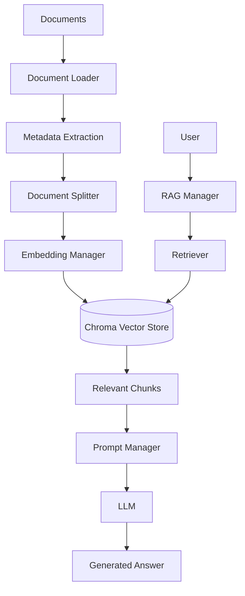

# 📄 AI Document Assistant

A modular Retrieval-Augmented Generation (RAG) application built with **LangChain**, **ChromaDB**, and **Hugging Face Embeddings**. The assistant ingests documents, creates semantic embeddings, stores them in a persistent vector database, and answers user questions using only the information contained in the uploaded documents.

Designed with a clean, modular architecture, each stage of the RAG pipeline is separated into dedicated managers, making the project easy to understand, maintain, and extend.

---

## ✨ Features

- 📄 Supports 12 document formats
  - PDF, DOCX, TXT, Markdown, HTML, CSV, XLSX, XLS, PPTX, JSON, XML, EML

- 🧩 Modular architecture with dedicated managers for:
  - Document Processing (loading, splitting, metadata)
  - Embeddings
  - Vector Store
  - Retrieval
  - Prompt Management
  - LLM Integration
  - RAG Pipeline

- 🔍 Semantic search using vector embeddings

- 🧠 Hugging Face embedding models (BAAI/bge-large-en-v1.5)

- 💾 Persistent Chroma vector database

- 📝 Automatic document metadata extraction

- 🔐 SHA-256 duplicate document detection (skips re-ingesting a file already in the store)

- 💬 Interactive command-line interface

- 📚 Source-aware responses with retrieved document chunks

- ⚙️ Centralized configuration using a settings file

---

# 🏗️ Architecture



---

# 📂 Project Structure

```text
AI-Document-Assistant
│
├── config/
│   └── settings.py
│
├── data/
│   ├── documents/
│   └── chroma_db/
│
├── document_processing/
│   ├── document_loader.py
│   ├── document_manager.py
│   ├── document_metadata.py
│   └── document_splitter.py
│
├── embeddings/
│   └── embedding_manager.py
│
├── llm/
│   └── llm_manager.py
│
├── prompts/
│   └── prompt_manager.py
│
├── rag/
│   └── rag_manager.py
│
├── retrieval/
│   └── retriever_manager.py
│
├── vector_store/
│   └── vector_store_manager.py
│
├── ingest.py
├── run.py
├── requirements/
│   ├── base.txt
│   └── loaders.txt
└── README.md
```

---

# ⚙️ How It Works

The application follows a standard Retrieval-Augmented Generation (RAG) workflow:

1. Documents are loaded from the data directory.
2. Metadata (document ID, SHA-256 file hash, file type) is extracted for every document.
3. The document manager checks the vector store for a matching file hash and skips ingestion if it's a duplicate.
4. Each new document is split into smaller chunks.
5. Embeddings are generated for every chunk.
6. Embeddings are stored in a persistent Chroma vector database.
7. User queries are converted into embeddings.
8. The retriever performs semantic similarity search.
9. Retrieved context is combined with the prompt.
10. The language model generates an answer using only the retrieved context.

---

# 🚀 Installation

Clone the repository:

```bash
git clone https://github.com/shiznit9/AI-Document-Assistant.git

cd AI-Document-Assistant
```

Create a virtual environment:

```bash
python -m venv .venv
```

Activate the environment:

### Windows

```bash
.venv\Scripts\activate
```

### Linux / macOS

```bash
source .venv/bin/activate
```

Install dependencies:

```bash
pip install -r requirements/base.txt -r requirements/loaders.txt
```

---

# ⚙️ Configuration

Update your API key inside the environment file (`.env`, already gitignored):

```env
MISTRAL_API_KEY=your_api_key
```

Modify application settings (embedding model, LLM model, chunk size, retriever parameters) in:

```text
config/settings.py
```

---

# 📥 Ingest Documents

Place your files inside:

```text
data/documents/
```

Then build the vector database:

```bash
python ingest.py
```

Documents already present in the vector store (matched by SHA-256 hash) are automatically skipped.

---

# 💬 Run the Assistant

```bash
python run.py
```

Example:

```text
Ask a question (or type 'exit'): What is Retrieval-Augmented Generation?

Answer:
{'answer': 'Retrieval-Augmented Generation (RAG) combines semantic retrieval with a language model by first retrieving relevant document chunks before generating a response.', 'sources': [...]}
```

---

# 🛠️ Tech Stack

- Python
- LangChain / LangChain Classic
- Mistral AI (`mistral-small-2506` via `langchain-mistralai`)
- Hugging Face Embeddings (`BAAI/bge-large-en-v1.5`)
- ChromaDB
- Sentence Transformers

---

# 📈 Future Improvements

- Hybrid Search (Dense + BM25)
- OCR Support
- Parent-Child Retrieval
- Multi-Vector Retrieval
- LangGraph Integration
- Streaming Responses
- Conversation Memory
- Web Interface (Streamlit / React)
- Re-ranking Models
- Multi-LLM Support
- Cleaner formatted CLI output (structured answer + bulleted sources)

---

# 📜 License

This project is licensed under the MIT License.

---

## 👨‍💻 Author

**Prakhar**

If you found this project useful, consider giving it a ⭐ on GitHub.
